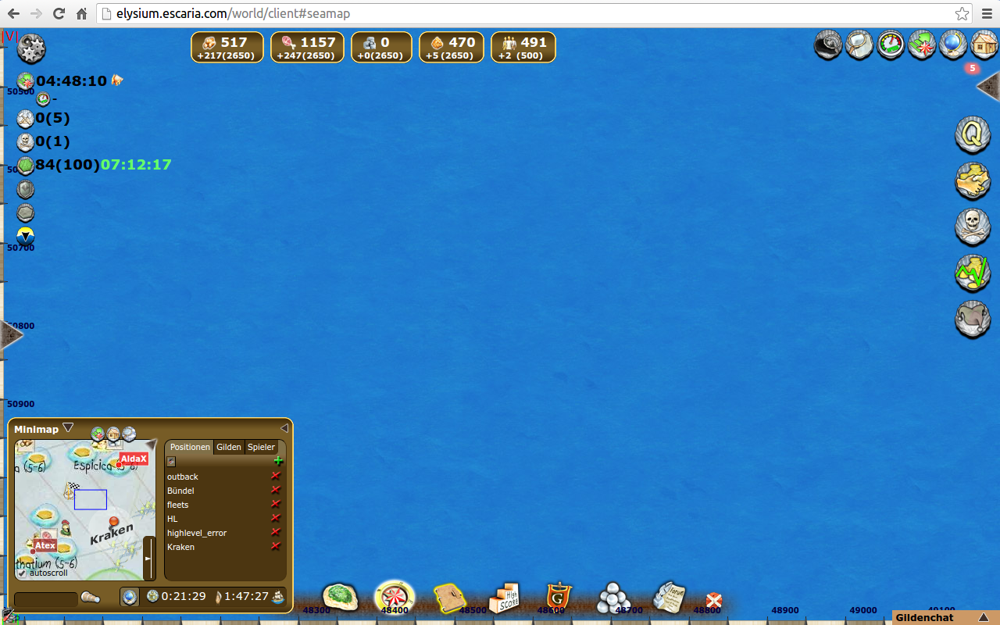
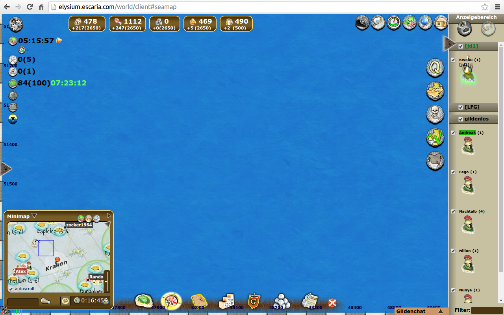
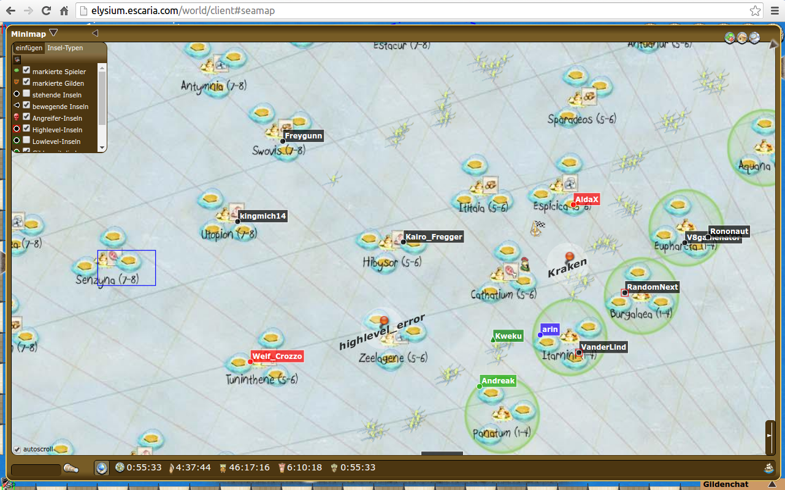

# seamapPlus
Dieses Browser-Add-on erweitert die Seekarte des Browsergames [Escaria](https://www.escaria.com) um viele nützliche Funktionen. Dazu gehören: Eine Weltkarte in welcher andere Inseln und NPCs eingetragen werden, die Möglichkeit andere Spieler und Gilden zu markieren, eine Seitenleiste mit Suchfunktion, die Möglichkeit Positionen auf der Karte zu speichern, und viele grafische Verbesserungen der Seekarte.
Forenthread:
http://forum.escaria.com/index.php?page=Thread&threadID=8557

## Download:

[Installation für Firefox](https://addons.mozilla.org/de/firefox/addon/seamapplus/)

[Installation für Chrome](https://chrome.google.com/webstore/detail/seamapplus/fhpjcdjlbcijcgjdhaadjmjfabhijgmf)

[Installation für Opera](https://addons.opera.com/de/extensions/details/seamapplus/?display=de)

## Kurzbeschreibung:
Die Erweiterung besitzt ein umfangreiches Tutorial, welches sämtliche Funktionen von seamapPlus vorstellt.
Hier ist eine kleine Auflistung der wichtigsten Features:

### 1 Seitenleiste
Die Seitenleiste wird mit Klick auf den Button am rechten Bildschirmrand eingeblendet. Mit ihr ist es leicht sich in großen Insel-Ansammlungen zurecht zu finden. Einzelne Insel oder ganze Gilden können hervor gehoben oder ausgeblendet werden. Desweiteren können Inseln nach Namen gefiltert werden.

### 2 Minimap
Ausgestattet mit einer eigenen Zoomfunktion folgt die Minimap der Seekarte und kann zu einer vollwertigen Übersichtskarte vergrößert werden. Inseln, NPCs und gespeicherte Positionen werden darin abgebildet und verschaffen einem einen schnellen Überblick.

### 3 Seekarten-Verlauf
SeamapPlus merkt sich die Positionen der Seekarte! Mit den Vorwärts- und Rückwärtsbuttons kann man schnell durch den eigenen Positionenverlauf durchwechseln.

### 4 Wegzeiten
Eine Leiste berechnet die Wegzeiten für die Erkundung sowie Schiffzeiten für die aktuelle Position der Seekarte, der Weltkarte oder der genauen Position des Ringmenüs.

### 5 Positionen speichern
Wie auch in der Premium-Inselkarte der eigenen Insel kann SeamapPlus auch für die Seekarte Positionen speichern, zu welchen später mit einem Klick zurückgekehrt werden kann.

### 6 Spieler markieren
Desweiteren können auch Spieler gespeichert und mit einer Farbe versehen werden. Über die Liste kann man nicht nur schnell zu deren Position springen, diese werden auch auf See- und Weltkarte farbig hervor gehoben.

### 7 Gilden markieren
Das ist zu wenig Farbe? Natürlich können auch sämtliche Mitglieder von Gilden farbig hervor gehoben werden. Warum nur Feinde und Verbündete gesondert auf der Karte anzeigen, wenn man ein komplexes Farbsystem erstellen kann?

### 8 Reiseanzeige
Die Position der Reiseanzeige wurde in das "Zeiten-anzeige" verschoben und ist somit nicht nur auf der Seekarte sichtbar. Als weiteres Gimmig wurde die Boost-Zeitanzeige ebenfalls dorthin verschoben um einen schnellen Überblick über die Reisezeiten der Insel zu gewährleisten.

### 9 High-/Lowlevel-Anzeige
Inseln, welche sich in der Nähe einer Handelsstation befinden, die nicht deren Levelbereich entspricht werden automatisch auf See- und Weltkarte hervor gehoben.

### 10 Optionen
SeamapPlus kann natürlich an die eigenen Bedürfnisse angepasst werden. Über die Einstellungen kann beispielsweise die Größe der Minimap, die Größe der Icons auf der Weltkarte oder die Anzahl der automatisch gespeicherten Inseln verändert werden.
Und natürlich besitzt die Minimap ein Filtermenü über welches genau eingestellt werden kann, welche Inseln aufscheinen sollen und welche nicht.

### 11 Erweiterte Radius-Anzeige
Der Inselradius wird um den Sicht-Radius sowie Erkennungsradius erweitert

### 12 Chat-Erweiterung
Positionen können per Mausklick in den Gildenchat eingefügt werden und Koordinaten im Gildenchat werden anklickbar (für diejenigen, die kein Escamod besitzen)

## Screenshots:

# Achtung:
seamapPlus berücksichtigt noch keine Forschungslevel. Ich besitze momentan keine Insel mit weit genug fortgeschrittener Forschung. Daher kann ich es nicht testen. Wird aber noch nachgetragen^^
